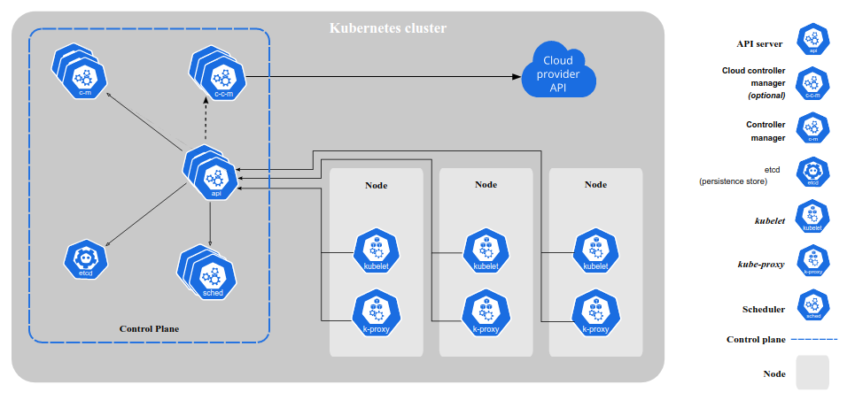

# k8s组件

## 集群相关组件图

## Control Plane Components(控制平面组件)

这一类组件的特定是做集群层面的全局决策, 探测并响应集群事件

可以运行在任意节点上. 简单起见, 启动脚本通常将所有Control Plane Components启动在同一机器, 并且不在该机器上启动用户容器

## kube-apiserver
API server是控制平面的前端, 暴露了k8s API

kube-apiserver是API的主要实现, 支持水平扩展, 可以部署多个实例来均衡流量

## etcd
etcd 是兼具一致性和高可用性的键值数据库，可以作为保存 Kubernetes 所有集群数据的后台数据库

## kube-scheduler
负责监视新创建的、未指定运行节点的 Pods，选择节点让 Pod 在上面运行

## kube-controller-manager
同一个进程包括了若干个控制器
1. Node Controller 负责在节点出现故障时进行通知和响应
2. Job controller 监测代表一次性任务的 Job 对象，然后创建 Pods 来运行这些任务直至完成
3. Endpoints Controller填充端点(Endpoints)对象(即加入 Service 与 Pod)
4. Service Account & Token Controllers 为新的命名空间创建默认帐户和 API 访问令牌

## cloud-controller-manager
嵌入特定云的控制逻辑的 控制平面组件

## Node组件

### kubelet

## Reference

<https://kubernetes.io/docs/concepts/overview/components/>
